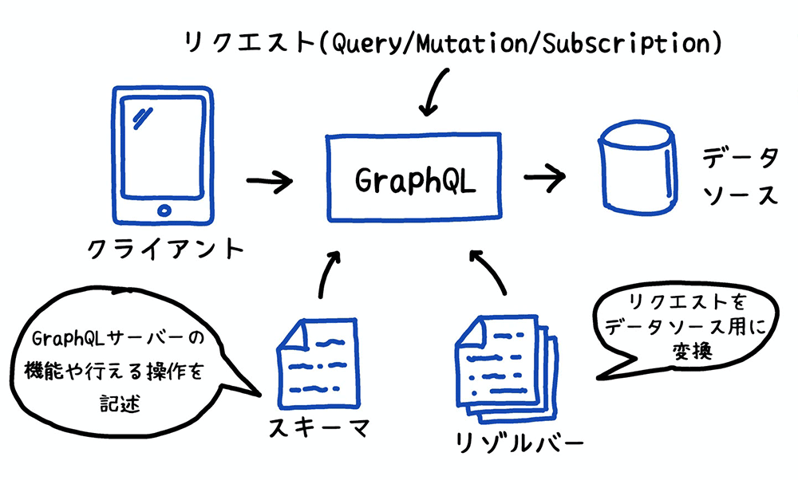
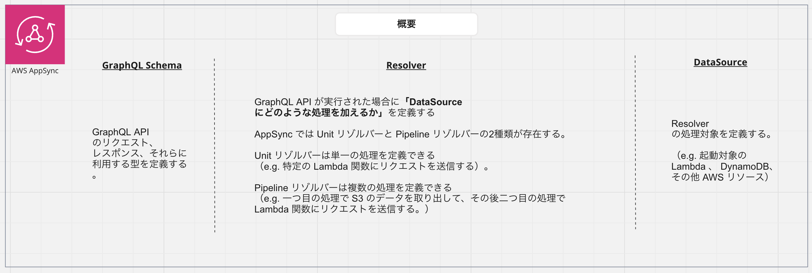
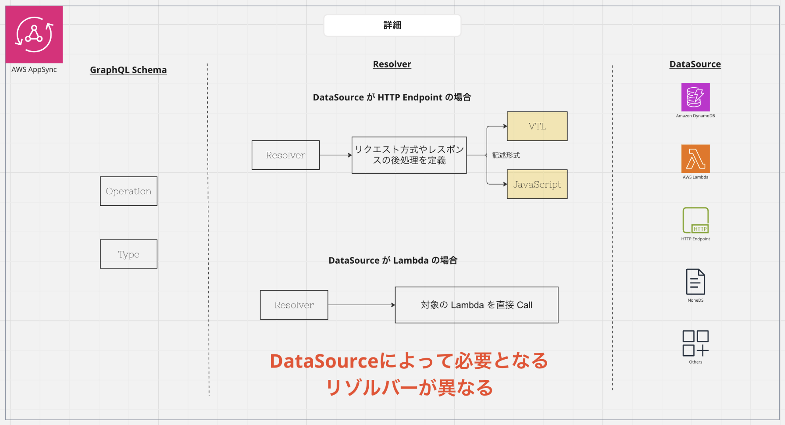

# AWS AppSync / GraphQL 概説

## やること

- [ ] GraphQL をざっくり理解する
- [ ] AWS AppSync をざっくり理解する

## GraphQL とは

GraphQL は、Facebook が開発したクエリ言語です。REST API に代わるものとして注目されています。
GraphQL では、 Client が必要なデータをクエリで指定することができます。これにより、不要なデータを取得することがなくなります。

### REST API とのデータ送受信における差分

REST API では、エンドポイントごとに固定のデータが返されます。たとえば、`/users` エンドポイントにアクセスすると、ユーザー一覧が返されます。

```json
[
  {
    "id": 1,
    "name": "Alice"
  },
  {
    "id": 2,
    "name": "Bob"
  }
]
```

GraphQL では、クエリを使って必要なデータを取得します。たとえば、`/graphql` エンドポイントに対して以下のクエリを送信すると、`id` が `1` のユーザーの `name` を取得できます。

```graphql
query {
  user(id: 1) {
    name
  }
}
```

```json
{
  "data": {
    "user": {
      "name": "Alice"
    }
  }
}
```

`id` はクエリで指定していないため、取得されません。このようにして、不要なデータを取得することがなくなります。

### 主要な概念

| 名前 | 説明 |
| --- | --- |
| Query | データの取得を行う操作の名称（REST API の GET に相当） |
| Mutation | データの作成、更新、削除を行う操作の名称（REST API の POST, PUT, DELETE に相当） |
| Subscription | データの変更を監視する操作の名称（REST API にはない概念） |
| Operation | Query, Mutation, Subscription の総称 |
| Schema | Query, Mutation, Subscription, Type の定義 |
| Type | Operation で取得、作成、更新、削除されるデータの型 |
| Resolver | Operation がデータソースにどのような処理を行うかを定義 |
| Data Source | Operation が処理するデータ |



ref: <https://aws.amazon.com/jp/builders-flash/202111/awsgeek-appsync/?awsf.filter-name=*all>


## AWS AppSync とは

GraphQL の概念を利用した AWS サービスです。
通常の GraphQL に対して、AWS サービスとの連携を容易にするための機能が追加されています。

> [!TIP] 
> ### GraphQL との主な差分
> 1. データソースとして、DynamoDB, RDS, Elasticsearch Service, Lambda, HTTP, AWS Lambda などを明> 示的に指定できる
> 2. データソースに対するアクセス権限を IAM ロールで制御できる
> 3. **リゾルバーは VTL または JavaScript で実装しなくてはならない **

### AppSync の概要



### AppSync の詳細


