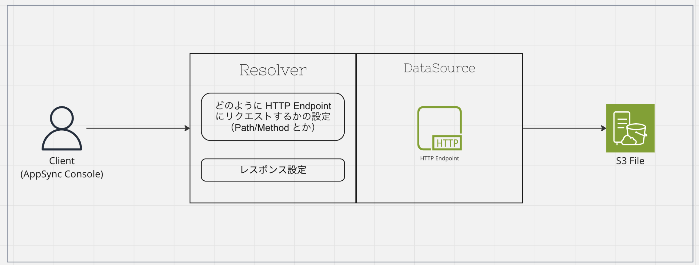
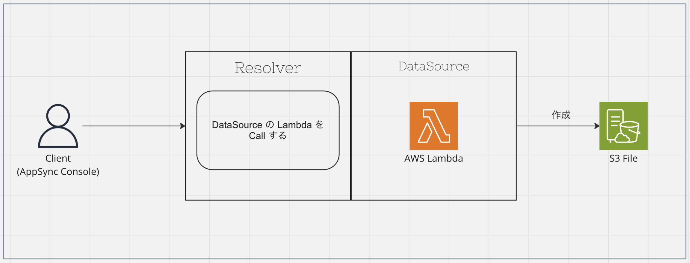

# とりあえず動かしてみる

## やること

- [ ] AWS AppSync の API を作成する
- [ ] Query を実行する
- [ ] Mutation を実行する
- [ ] (Optional) 取得するデータを増やしてみる

## 1. AWS AppSync の API を作成する

このリポジトリの `/cdk` ディレクトリに移動して、以下のコマンドを実行します。

```sh
npx cdk deploy
```

`✅  AppSyncSampleStack` と表示されれば成功です。

## 2. Query を実行する

1. AWS Console にログインして、AppSync のダッシュボードを開きます。
2. API 一覧から `AppSyncAPIDemo` を選択します。
3. 「クエリ」を選択して、 `getAppSyncDemo` を実行します。
    ```graphql
    query MyQuery {
        getAppSyncDemo(id: "1") {
            id
            name
        }
    }
    ```
    - 指定した id に対応するデータが返却されれば成功です。
3. 再度以下の `getAppSyncDemo` を実行して、エラーが出ることを確認します。
    ```graphql
    query MyQuery {
        getAppSyncDemo(id: "2") {
            id
            name
        }
    }
    ```

> [!NOTE]
> 
> この時点では `id` が `1` のデータしか登録されていないため、`id` が `2` のデータは取得できません。

### 処理の流れ（ざっくり）



## 3. Mutation を実行する

1. AWS Console にログインして、AppSync のダッシュボードを開きます。
2. API 一覧から `AppSyncAPIDemo` を選択します。
3. 「クエリ」を選択して、 `createAppSyncDemo` を実行します。
    ```graphql
    mutation MyMutation {
        createAppSyncDemo(id: "2", name: "kakukaku") {
            id
            name
        }
    }
    ```
    - 指定した id と name が返却されれば成功です。
4. `getAppSyncDemo` を実行して、登録したデータが取得できれば成功です。
    ```graphql
    query MyQuery {
        getAppSyncDemo(id: "2") {
            id
            name
        }
    }
    ```
    - 今度は `id` が `2` のデータが取得できます。

### 処理の流れ（ざっくり）



## 4. (Optional) 取得するデータを増やしてみる

1. AWS Console にログインして、AppSync のダッシュボードを開きます。
2. API 一覧から `AppSyncAPIDemo` を選択します。
3. 「スキーマ」を選択して、 `AppSyncDemo` を以下のように修正します。
    ```graphql
    type AppSyncDemo {
        id: ID!
        name: String!
        email: String
    }
    ```
4. 「クエリ」を選択して、 `getAppSyncDemo` を実行します。
    ```graphql
    query MyQuery {
        getAppSyncDemo(id: "1") {
            id
            name
            email
        }
    }
    ```
    - `email` が取得できないことを確認します
5. 「スキーマ」から `getAppSyncDemo` のリゾルバーを開きます。
6. `Resolver` の設定を以下のように修正します。
    ```graphql
    export function response(ctx) {
        const user = JSON.parse(ctx.result.body);

        return {
            id: user.id,
            name: user.name,
            email: user.email, // 追加
        };
    }
    ```
    - `email` を取得するように修正します
7. `getAppSyncDemo` を実行して、`email` が取得できることを確認します。
    ```graphql
    query MyQuery {
        getAppSyncDemo(id: "1") {
            id
            name
            email
        }
    }
    ```
    - `email` が取得できれば成功です。
