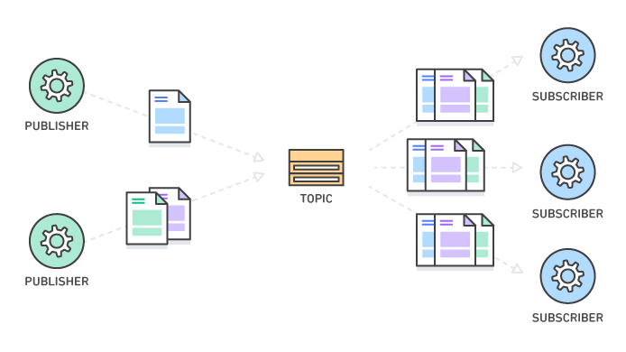

# Pub / Sub を構築してみる

## やること

- [ ] Pub / Sub とは何かを理解する
- [ ] AppSync API の作成
- [ ] Subscription を実行してみる
- [ ] Mutation にリゾルバーを設定する
- [ ] 改めて Subscription を実行してみる

## 1. Pub / Sub とは何かを理解する

Pub / Sub は、Publisher（発行者）と Subscriber（購読者）の間でメッセージを送受信するためのパターンです。

一般的には以下のようなイメージです。



一方、AppSync における Pub / Sub は、以下のようなイメージです。
Mutation が発行された際に、それに伴う変更を監視します。


## 2. AppSync API の作成

このリポジトリの `/amplify` ディレクトリ配下にある `graphql.schema` の設定を Amplify の GraphQL API に反映させて、AppSync API を作成します。

## 3. Subscription を実行してみる

1. AWS Console にログインして、AppSync のダッシュボードを開きます。
2. API 一覧から `appsynctutorial-dev` を選択します。
3. 「クエリ」を選択して、 `onCreateAppSyncDemo` を実行します。
    ```graphql
    subscription MySubscription {
        addedMessage {
            message
            messageId
        }
    }
    ```
    - 待機状態になったら完了です
4. 別のタブを開いて、 `sendMessage` を実行します。
    ```graphql
    mutation MyMutation {
        sendMessage(message: "test", messageId: "xxx") {
            message
            messageId
        }
    }
    ```
    - 3. Subscription のタブに戻り、何も起こっていないことを確認します。

> [!IMPORTANT]
> ### なぜ何も起こらないのか？
> AppSync で Subscription を使って特定の Mutation を監視する場合、その Mutation には必ずリゾルバーを設定する必要があります。
> リゾルバーが設定されていない場合、 Mutation に関する処理は実質的に何も行われないため、Subscription にも反映されません。

## 4. Mutation にリゾルバーを設定する

1. AWS Console にログインして、AppSync のダッシュボードを開きます。
2. API 一覧から `appsynctutorial-dev` を選択します。
3. 「スキーマ」を選択して、 `sendMessage` のリゾルバーを設定します。
    ```vtl
    // request mapping template
    {
        "version": "2017-02-28",
        "payload": {
            "messageId": "$util.autoId()",
            "message": "$context.arguments.message"
        }
    }

    // response mapping template
    // request mapping template の payload に含まれるものをそのまま返す設定です。
    $util.toJson($context.result)
    ```

## 5. 改めて Subscription を実行してみる

1. AWS Console にログインして、AppSync のダッシュボードを開きます。
2. API 一覧から `appsynctutorial-dev` を選択します。
3. 「クエリ」を選択して、 `onCreateAppSyncDemo` を実行します。
    ```graphql
    subscription MySubscription {
        addedMessage {
            message
            messageId
        }
    }
    ```
    - 待機状態になったら完了です
4. 別のタブを開いて、 `sendMessage` を実行します。
    ```graphql
    mutation MyMutation {
        sendMessage(message: "test", messageId: "xxx") {
            message
            messageId
        }
    }
    ```
    - 3. Subscription のタブに戻り、 `message` と `messageId` が取得できたら成功です

